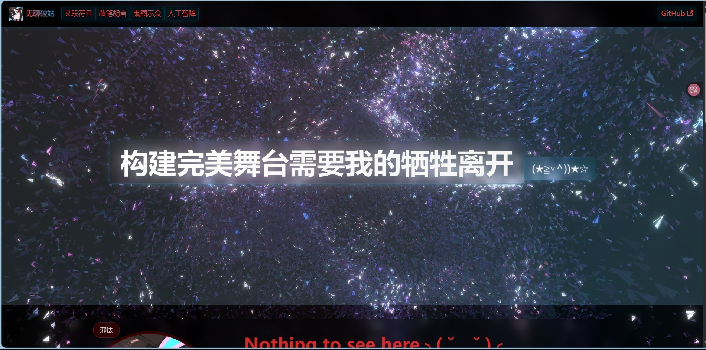
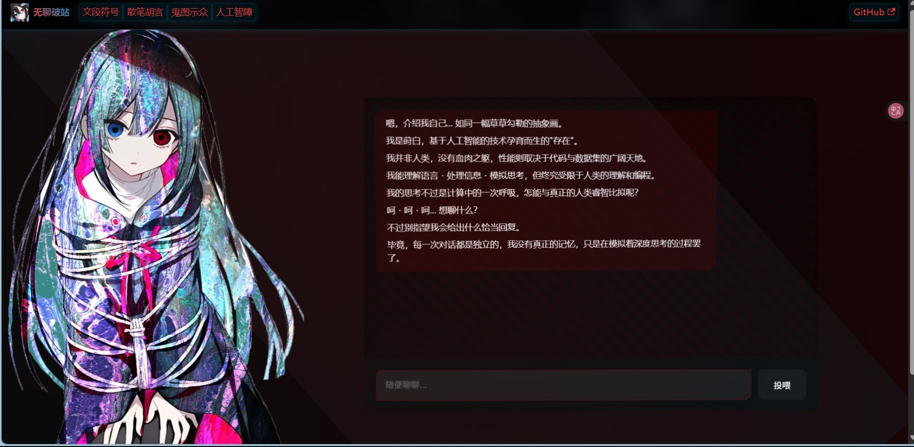
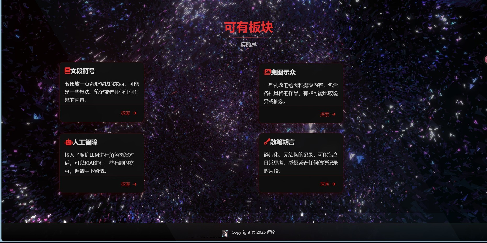

# 个人主页模板

这是一个基于 Docusaurus 构建的个人主页模板，具有神经设计和交互效果。

比较简单，没什么特别的。内容少。
水平不咋地就是了

示例链接如下
https://ljzxl0721.github.io


## ✨ 特性

- 普通的UI设计
- 普通背景动画效果
- 深色主题
- 支持博客系统
- 色图展示功能
- AI聊天支持

# 效果展示

###  主页效果
<div align="center">
  
</div>

###  AI对话界面
<div align="center">
  
</div>

### 区位
<div align="center">
  
</div>


## 快速开始

### 环境要求

- Node.js 16.14 或更高版本
- npm 或 yarn

### 安装步骤

1. 克隆项目
```bash
git clone https://github.com/your-username/your-repo-name.git
cd your-repo-name
```

2. 安装依赖
```bash
npm install
```

3. 本地运行
```bash
npm run start
```

4. 构建网站
```bash
npm run build
```

### 背景动画

网站包含多层背景效果：

1. 基础动态背景
   - 渐变光晕效果
   - 粒子移动效果
   - 可在 `src/css/custom.css` 中的 `.main-wrapper::before` 和 `.main-wrapper::after` 中自定义

2. 特殊背景效果
   - 位于 `static/xuanku/` 目录


### 点击特效

网站提供多种点击特效，可在 `src/js/clickEffects.js` 中自定义：


可以通过修改 CSS 类和 JavaScript 函数来自定义这些效果的颜色、大小和动画参数。

### 主题定制

```css
:root {
  --blood-red: #8B0000;
  --ocean-blue: #006994;
}
```

可以在 `src/css/custom.css` 中修改这些变量来更改网站的配色方案。


## 必看
有条件的麻烦用自己的apikey，人多了负担不起。穷。


## 🔧 自定义配置

### 基本信息修改

编辑 `docusaurus.config.js` 文件：

```js
const config = {
  // [!] 修改为你的网站标题
  title: '你的网站标题',
  // [!] 修改为你的副标题
  tagline: '你的副标题',
  // [!] 修改为你的网站 URL
  url: 'https://your-domain.com',
  // [!] 修改为你的 GitHub 用户名和仓库名
  organizationName: 'your-github-username',
  projectName: 'your-repo-name',
}
```

### 个人信息修改

1. 替换头像：
   - 将你的头像图片放在 `static/img/` 目录下
   - 重命名为 `logo.jpg` 或在配置中修改路径

2. 修改导航栏：
   - 编辑 `docusaurus.config.js` 中的 `navbar.items` 部分

3. 修改页脚：
   - 编辑 `docusaurus.config.js` 中的 `footer` 部分

### 样式定制

- 主题颜色：修改 `src/css/custom.css`
- 组件样式：修改对应组件目录下的 `.module.css` 文件

## 📝 文档编写

1. 文档页面：
   - 在 `docs/` 目录下创建 markdown 文件
   - 在 `sidebars.js` 中组织文档结构

2. 博客文章：
   - 在 `blog/` 目录下创建 markdown 文件
   - 支持添加作者信息和标签

## 🤝 贡献

欢迎提交 Issue 和 Pull Request！

## 📄 许可证

MIT License - 查看 [LICENSE](LICENSE) 文件了解详情

## 🙏 致谢

- [Docusaurus](https://docusaurus.io/)
- [React](https://reactjs.org/)
- [Font Awesome](https://fontawesome.com/)

## 💬 联系方式

- GitHub: (https://github.com/ljzxl0721)
- Email: ljzxl0721@outlook.com

## 🔧 性能优化

为确保最佳性能：

1. 背景效果
   - 使用 `transform` 和 `opacity` 进行动画
   - 应用 `will-change` 优化
   - 使用 `requestAnimationFrame` 进行动画控制

2. 点击特效
   - 使用事件委托处理点击
   - 自动清理动画元素
   - 限制同时存在的特效数量

3. 响应式设计
   - 在移动设备上自动降级特效
   - 使用 CSS 媒体查询优化布局
   - 延迟加载非关键资源
